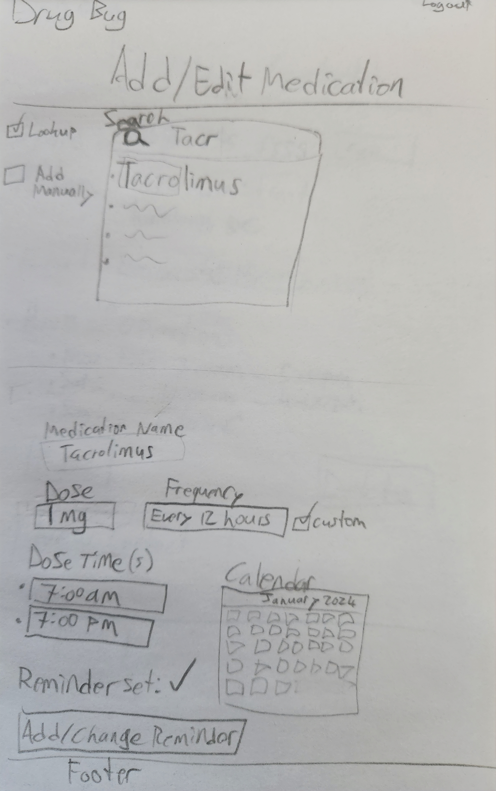
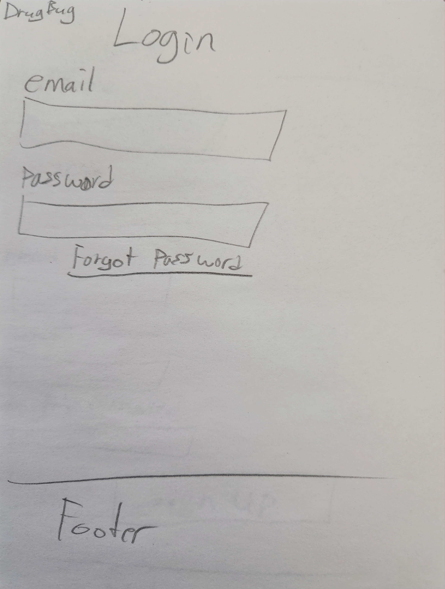
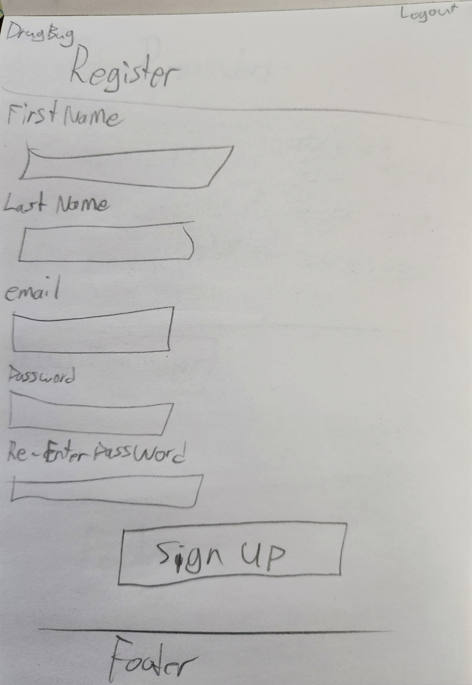
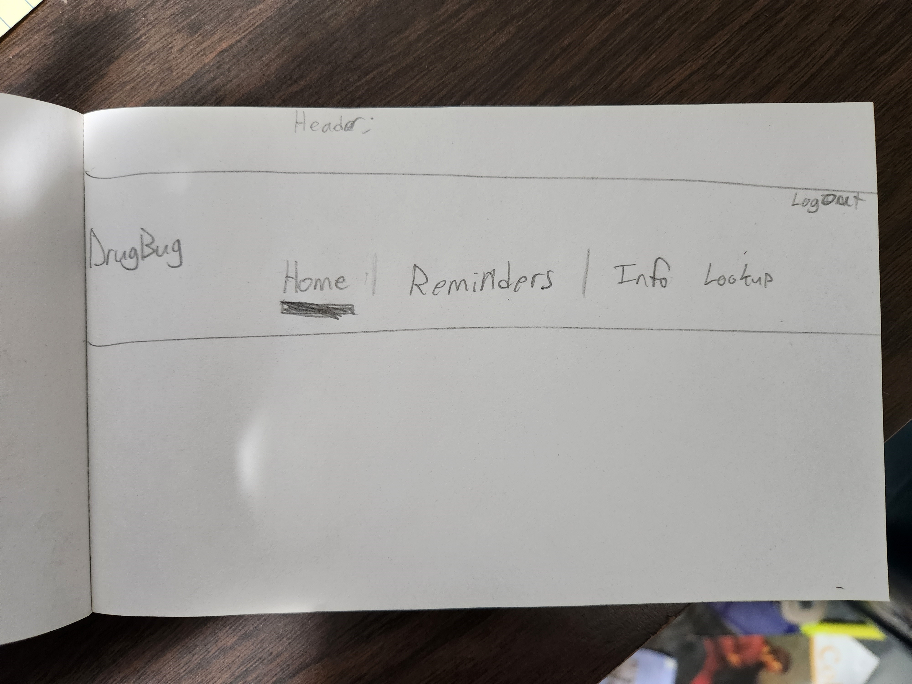
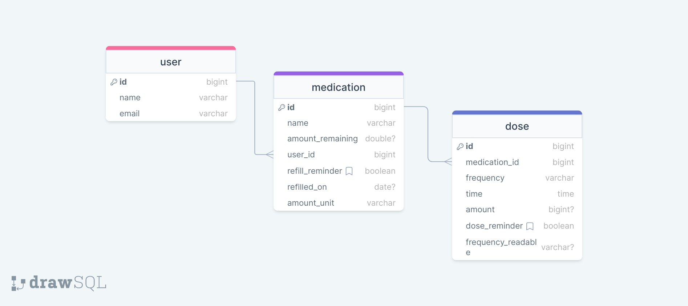
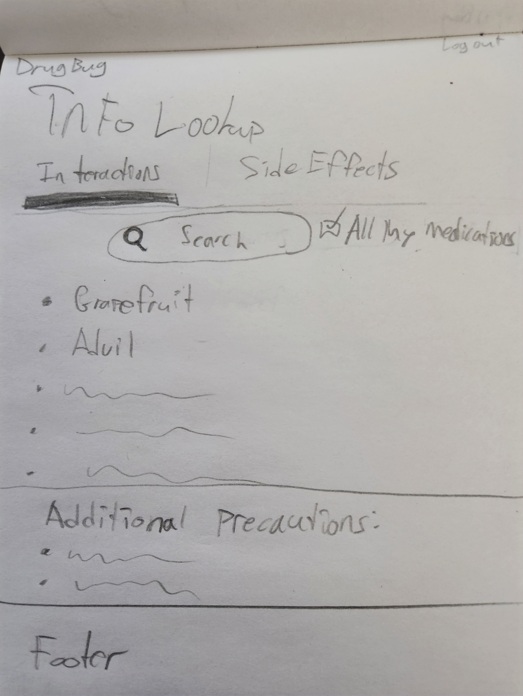
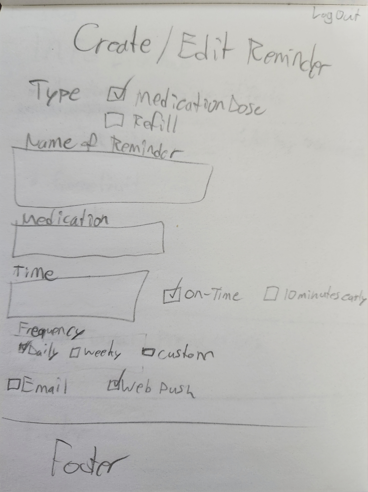
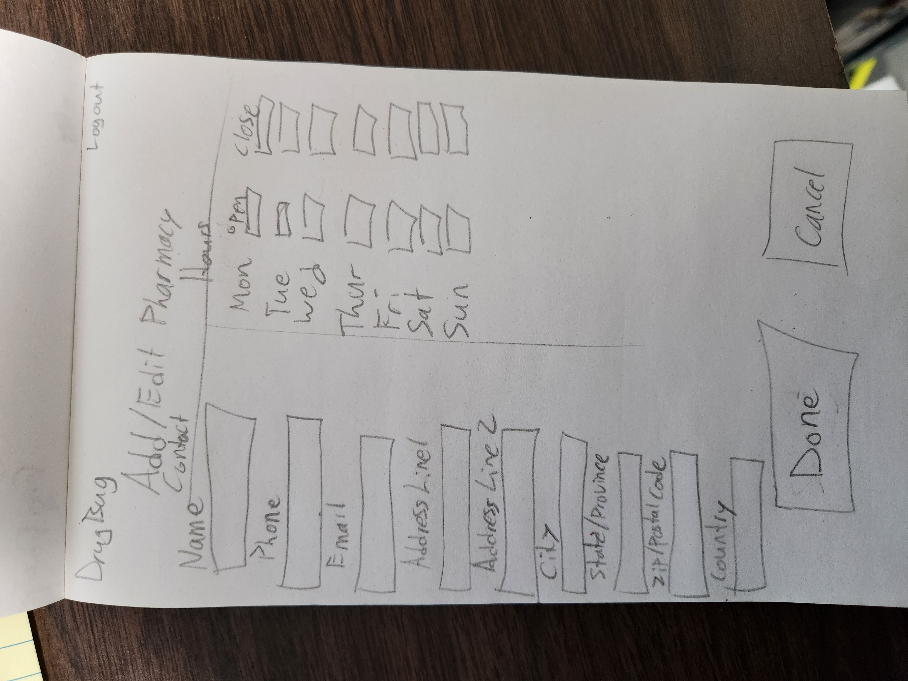

# Project Title

DrugBug

## Overview

DrugBug is a great way for people to track their medications and quickly reference helpful information about them.

### Problem

As a father of a transplant patient, I know how much work it can be to keep track when someone is on multiple medications.
I can't tell you how many times my child has wanted to try some new juice or fruit and I had to look up on Google whether it interacts with any of her medications, only to still feel uneasy about whether I should trust the sources.
Sometimes, life happens and I find myself so busy or distracted that I end up late for a medicine dose time.
There can be so many things to stay on top of including:

- When to take each medicine
- Different and evolving doses
- When to order refills
- Which medications need to be taken with/without food
- Which foods to avoid
- Possible interactions with other over-the-counter drugs
- Which side effects to look out for

### User Profile

This app will be great for people who take multiple medications regularly and could use some help staying on top of all the details. Lots of people take various medications and could benefit from having reminders and a centralized place to find information specific to their medication needs.

- Seniors
- People with who take multiple medications regularly
- Nurses or caretakers of people on medication

### Features

- As a logged in user, I want to be able to receive notifications as reminders for medication times
- As a logged in user, I want to be able to receive notifications as reminders for when to order medication refills
- As a logged in user, I want to be able to see a page with all of the medications I am using and any upcoming reminders for them.

## Implementation

### Tech Stack

- React
- Node
- MySQL
- Express
- Client Libraries:
  - react
  - react-router
  - axios
  -  Bootstrap
- Server Libraries:
  - Bree
  - knex
  - express
  - possibly Firebase
  - [NotificationApi](https://www.notificationapi.com)

### APIs

- I do not need API's for data unless I make the info lookup functionality in my Nice-to-Haves.
	- The API for that is [OpenFDA Drug Labelling API](https://open.fda.gov/apis/drug/label)

### Sitemap

- Home page
- Add/edit medications
- Login
- Register

### Mockups

### Home


### Add/edit Medications



### Login



### Register




### Header (visible on all pages)



### Data



### Endpoints

**GET /medications**

- Get list of medications for the user

**Parameters:**

- user id

**Response:**

```
 [
	{
		"id": 1,
		"name": "Tacrolimus",
		"amount_remainting": 150,
		"refill_by": 1706636864,
		"user_id": 1,
		"refill_reminder": true,
	},
	...
]
```

**POST /medications/:id**

- Create new medication and doses

**Parameters:**

- userId
- medication name
- amount remaining
- refill reminder (true/false)
- dose amount
- dose frequency
- dose time
- dose reminder(true/false)

**Response:**

```
 [
	{
		"id": 1,
		"name": "Tacrolimus",
		"amount_remainting": 150,
		"refill_by": 1706636864,
		"user_id": 1,
		"refill_reminder": true,
		"dose": [
					{
						"id": 1,
						"medication_id": 1,
						"frequency": 43200000,
						"time": '838:59:59',
						"amount": 0.7,
						"dose_reminder": true,
						"freqency_readable": "Every 12 hours"
					},
					...
				]
	},
	...
]
```

**GET /doses/:userId**

- Get all doses for a user

**Parameters:**

- medication id

**Response:**

```
[
	{
		"id": 1,
		"medication_id": 1,
		"frequency": 43200000,
		"time": '838:59:59',
		"amount": 0.7,
		"dose_reminder": true,
		"freqency_readable": "Every 12 hours"
	},
	...
]
```

**PUT /medications/:id**

- Edit medication and/or doses

**Parameters:**

- userId
- medication name
- amount remaining
- refill reminder (true/false)
- dose amount
- dose frequency
- dose time
- dose reminder(true/false)

**Response:**

```
 [
	{
		"id": 1,
		"name": "Tacrolimus",
		"amount_remainting": 150,
		"refill_by": 1706636864,
		"user_id": 1,
		"refill_reminder": true,
		"dose": [
					{
						"id": 1,
						"medication_id": 1,
						"frequency": 43200000,
						"time": '838:59:59',
						"amount": 0.7,
						"dose_reminder": true,
						"freqency_readable": "Every 12 hours"
					},
					...
				]
	},
	...
]
```


### Auth

The app will need to use auth for signup and login so the user's medication info can be stored on the server.

## Roadmap

- Create the server
  - Express server with routes
- Create the client
  - React project with routes and boilerplate pages
- Create migrations
- Create database
- Create knex functions
- Implement auth for client and server
- - Implement database queries and routes
- Create and style front-end components and pages
  - Implement forms and their logic
- Implement Notification API
  - Setup notifications
    - refills
    - dose reminders
- Setup WebPush permission on front end
- Bug fixes
- Demo Day

## Nice-to-haves

- As a logged in user, I want to be able to quickly check for information such as drug/food interactions and side effects for all the medications I am taking in a single search
- More complex dosage and reminders use cases
- More information searchable for medications
- As a logged in user, I want to have quick access to information about my preferred pharmacy such as contact information and hours of operation
- As a logged in user, I want to have quick access to my doctor's contact information

**GET https://api.fda.gov/drug/label.json?search=boxed_warning:(medication name)**

- Get drug and food interactions for a medication

**Parameters:**

- medication name

**Response:**

```
...
"results": [
				{
					"effective_time":  "20211007",
					"drug_interactions": [
										    "7 DRUG INTERACTIONS Mycophenolic Acid Products..."
										 ]
				},
				...
```
### Info Lookup



### Create/edit Reminders



### Doctor/Pharmacy Info


### Add/Edit Doctor/Pharmacy


<!--stackedit_data:
eyJoaXN0b3J5IjpbNDcxMTE5Mjc0LC0yMTA3ODMzOTE5XX0=
-->
